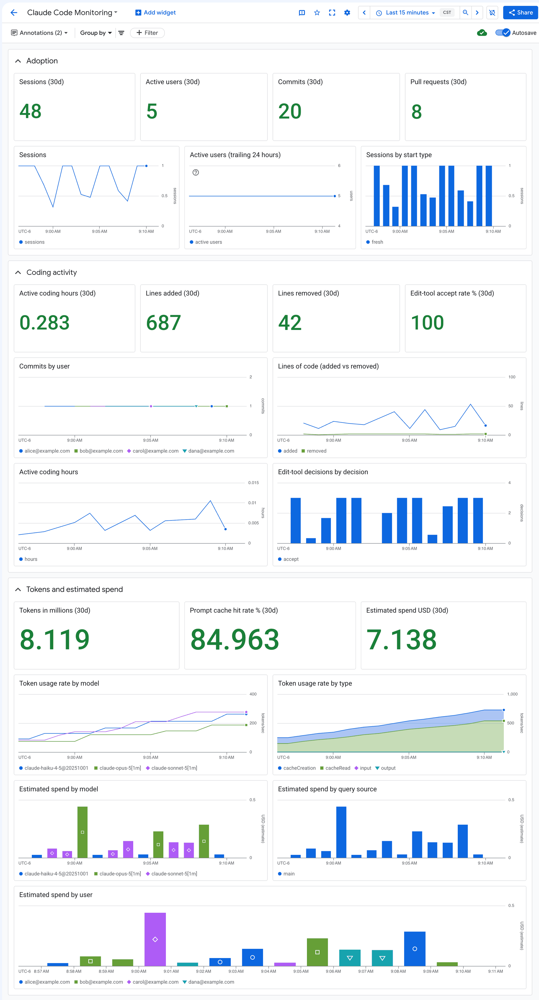

### Dashboards for Claude Code

|Claude Code Monitoring|
|:---------------------|
|Filename: [claude-code-monitoring.json](claude-code-monitoring.json)|
|Adoption (sessions, active users, commits and pull requests made through Claude Code), coding activity (active coding hours, lines of code, edit-tool accept rate) and tokens with estimated spend by user, model and query source, built on [Claude Code's OpenTelemetry metrics](https://code.claude.com/docs/en/monitoring-usage).|
||

#### Prerequisites

* **Claude Code telemetry is enabled.** Set `CLAUDE_CODE_ENABLE_TELEMETRY=1`, `OTEL_METRICS_EXPORTER=otlp` and an OTLP endpoint in the Claude Code [settings](https://code.claude.com/docs/en/settings) on each developer's machine. For an organization-wide rollout, use managed settings deployed by your mobile device management (MDM) tool, the software an IT team uses to configure company machines. Alternatively, have developers sign in through [Claude apps gateway](https://code.claude.com/docs/en/claude-apps-gateway). The gateway pushes the telemetry settings to every signed-in client, so developers set no OpenTelemetry variables on their machines.
* **Every metric point carries the user's ID as `user.email`.** The by-user tiles group on it, so each metric point must carry it. Sessions signed in with a Claude account set it automatically. So do sessions signed in through Claude apps gateway, where every export is identity-stamped with the email the developer signed in with. Sessions that use an API key or call Agent Platform directly set none, so add it to `OTEL_RESOURCE_ATTRIBUTES`, for example `user.email=dev@example.com`, with your MDM tool writing each developer's own value on their machine. See [Where the user ID comes from](#where-the-user-id-comes-from).
* **Metrics arrive through the [Telemetry (OTLP) API](https://cloud.google.com/stackdriver/docs/reference/telemetry/overview).** Claude Code can send to `https://telemetry.googleapis.com` directly, through an OpenTelemetry Collector that forwards over OTLP, or through Claude apps gateway. The gateway relays each client's exports unchanged to the OTLP destinations listed under `telemetry.forward_to` in its configuration. If metrics reach `telemetry.googleapis.com` with no collector in between, whether sent from a workstation or relayed by the gateway, they need extra resource attributes and credentials, described in [Sending directly to telemetry.googleapis.com](#sending-directly-to-telemetrygoogleapiscom). In every case, the metrics keep their OpenTelemetry names. For example, `claude_code.session.count` is stored as `prometheus.googleapis.com/claude_code.session.count/delta`, and the dashboard queries it as `{"__name__"="claude_code.session.count"}`. A collector that exports with `googlemanagedprometheus` instead stores Prometheus-normalized names such as `claude_code_session_count_total`, which these queries don't match.
* **APIs and roles.** Enable `telemetry.googleapis.com` and `monitoring.googleapis.com` on the project. Grant `roles/telemetry.writer` to whoever sends the data: each developer when sending directly, or the collector's service account. User credentials also need `roles/serviceusage.serviceUsageConsumer` on the quota project.
* **Export interval.** Leave `OTEL_METRIC_EXPORT_INTERVAL` at its default of 60000, and never set it below 15000. Cloud Monitoring rejects a delta point that arrives less than about 15 seconds after the previous point in the same series. The OpenTelemetry SDK reports this only as `Bad Request`, so a shorter interval silently drops data.

#### Where the user ID comes from

The by-user tiles group on the `user.email` attribute. These are Active users (30d), Active users (trailing 24 hours), Commits by user and Estimated spend by user. How `user.email` gets onto each metric point depends on how the developer signs in:

|Sign-in|How `user.email` is set|
|:------|:----------------------|
|Claude account|Automatically, to the account's email address.|
|Claude apps gateway|Automatically, to the email address from the developer's single sign-on. A `user.email` in `OTEL_RESOURCE_ATTRIBUTES` is ignored.|
|An API key, or a cloud provider such as Agent Platform called directly|Not set. Add it to each developer's `OTEL_RESOURCE_ATTRIBUTES`, for example `user.email=dev@example.com`.|

In the last case, Claude Code copies resource attributes onto every metric point, because `OTEL_METRICS_INCLUDE_RESOURCE_ATTRIBUTES` defaults to `true`. With managed settings, your MDM tool writes each machine's value into the file.

Don't group on `user.id` instead. Outside the gateway it is a random identifier for one installation, so a developer who works on two machines counts as two users.

The by-user tiles show each developer's email address, so check who can see them before sharing the project or a screenshot.

#### Sending directly to telemetry.googleapis.com

With no collector in between, Claude Code has to supply what a collector usually adds.

* **Three more resource attributes** in `OTEL_RESOURCE_ATTRIBUTES`, for example `gcp.project_id=YOUR_PROJECT_ID,cloud.region=us-central1,service.instance.id=MACHINE_NAME,user.email=dev@example.com`:
  * `cloud.region` and `service.instance.id` become the required `location` and `instance` labels of the `prometheus_target` resource. Metric points without them are rejected.
  * `gcp.project_id` is required for logs and traces.
  * If you use a regional endpoint, set `cloud.region` to that endpoint's region.
* **Credentials.** Use `OTEL_EXPORTER_OTLP_PROTOCOL=http/protobuf`, and an `otelHeadersHelper` script that prints a Google access token and the quota project as request headers.

For a workstation that sends directly, a complete settings file looks like this:

```json
{
  "env": {
    "CLAUDE_CODE_ENABLE_TELEMETRY": "1",
    "OTEL_METRICS_EXPORTER": "otlp",
    "OTEL_EXPORTER_OTLP_PROTOCOL": "http/protobuf",
    "OTEL_EXPORTER_OTLP_ENDPOINT": "https://telemetry.googleapis.com",
    "OTEL_RESOURCE_ATTRIBUTES": "gcp.project_id=YOUR_PROJECT_ID,cloud.region=us-central1,service.instance.id=MACHINE_NAME,user.email=dev@example.com"
  },
  "otelHeadersHelper": "/usr/local/bin/claude-code-otel-headers.sh"
}
```

The dashboard needs only metrics. To also send events such as `api_request` to Cloud Logging, add `"OTEL_LOGS_EXPORTER": "otlp"`. To send traces to Cloud Trace, add `"OTEL_TRACES_EXPORTER": "otlp"` and `"CLAUDE_CODE_ENHANCED_TELEMETRY_BETA": "1"`, because trace export is in beta and needs both. Also enable `cloudtrace.googleapis.com` on the project, or the Telemetry API discards the spans.

Install the headers helper at the path named in `otelHeadersHelper` and make it executable. It sends each developer's own access token, so every machine needs the Google Cloud CLI signed in as that developer. If it isn't, the helper exits with an error and prints no headers, rather than printing a header with an empty token. Claude Code re-runs the helper every 29 minutes, and access tokens last one hour.

```bash
#!/usr/bin/env bash
# claude-code-otel-headers.sh: prints the auth headers for telemetry.googleapis.com.
set -euo pipefail

# Fetch the token first, so a failed gcloud call stops the script here.
token="$(gcloud auth print-access-token)"
printf '{"Authorization":"Bearer %s","x-goog-user-project":"%s"}\n' \
  "$token" "YOUR_PROJECT_ID"
```

#### Notes

* Each Claude Code counter starts at zero per session, so every tile uses `increase()` or `rate()` over a window.
  * The time-series charts use `[${__interval}]`, so each point is the total for its own time bucket.
  * "Active users (trailing 24 hours)" instead counts distinct users over the 24 hours before each point.
  * The 30-day scorecards need a dashboard time range of about a day or longer.
* `commit` and `pull_request` count only git actions taken through Claude Code.
* `claude_code.cost.usage` is Claude Code's own estimate at list price, not billed spend. When a session exits within about 15 seconds of its last export, its final metrics are rejected, so the dashboard can run slightly below the per-request `cost_usd` on `api_request` log events.
* The prompt cache hit rate is `cacheRead / (input + cacheRead + cacheCreation)` tokens.
