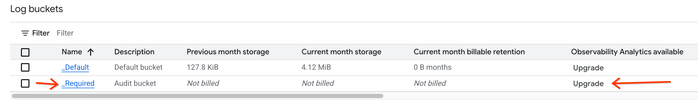
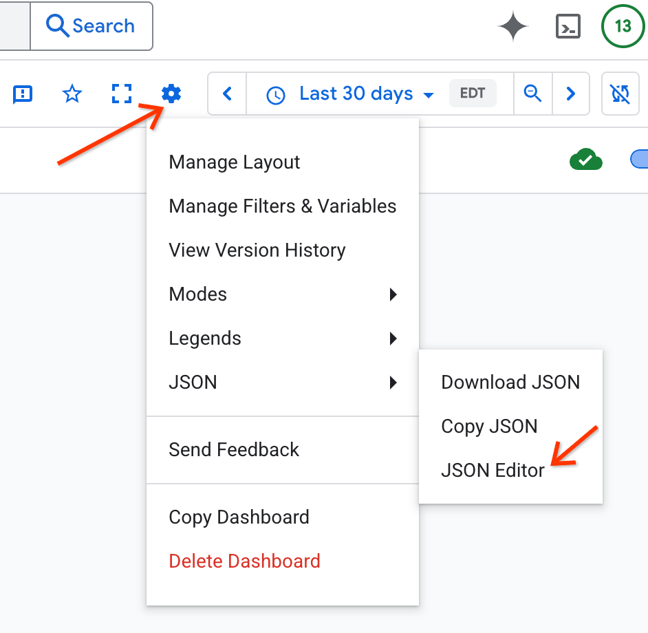

### Compute Engine - Instance Maintenance Events Setup

#### Log Storage Upgrade

In order to use the Compute Engine - Instance Maintenance Events dashboard the
`_Required` Logs must have it's Log Storage upgraded.

**NOTE**: There is no additional cost for upgraded Log Storage

1. Go to the Google Cloud
[Log Storage](http://console.cloud.google.com/logs/storage) page in the project
where you want to create the dashboard

2. Click the `Upgrade` button for the row with the `_Required` logs

      

3. Click the `Upgrade` button in the dialog that is opened.

**NOTE**: Only maintenance events that are logged after the Log Storage upgrade
will be seen in the dashboard

#### JSON String Replacement

The maintenance-system-event.json needs to have `REPLACE_PROJECT_ID` replaced
before the dashboard can be used.

1. Go to the
[Cloud Monitoring Dashboards](http://console.cloud.google.com/monitoring/dashboards)
page

2. Click the `Create Custom Dashboard` button
3. Click the settings icon and select the `JSON Editor`:

      

4. Copy and paste the JSON from the
[maintenance-system-events.json](maintenance-system-events.json) file into the
JSON Editor
5. Use `Cmd+F` to open the Find tool
6. Expand the Find tool to expose the Replace functionality:

      

7. Enter `REPLACE_PROJECT_ID` in the Find text and your project id in the
Replace text
8. Click the replace all icon in the Find tool
9. Click the `Apply Changes` in the JSON Editor
10. Your dashboard is ready for use, you can close the JSON Editor
