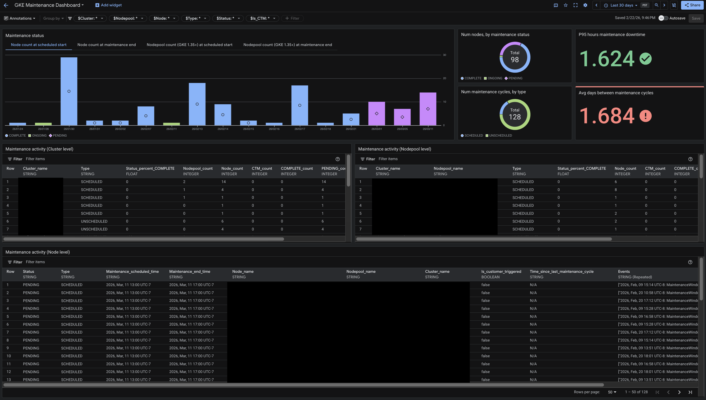

## Dashboards for Google Kubernetes Engine AI

This repo provides a sample dashboard for monitoring the maintenance operations of long running GKE clusters. This will live under Google Cloud Monitoring, and it’s built on top of [Log Analytics](https://cloud.google.com/logging/docs/log-analytics#analytics).



This dashboard has the following tables and charts, including:
- Maintenance activity tables at the cluster, nodepool, and node level
- Number of maintenance cycles, by type (SCHEDULED/UNSCHEDULED)
- Number of nodes, by maintenance status (PENDING/ONGOING/COMPLETE)
- Bar chart showing the node status of scheduled maintenance cycles, at their scheduled start time
- Scorecard of the average number of days between maintenance cycles
- Scorecard of the P95 number of hours nodes are down for maintenance

It is designed to work with all GKE versions, including versions older than 1.35.0. However, using GKE 1.35.0 or newer, there is less complexity to the query logic and additional context (Reschedules, Cancellations, and Nodepool information).

### Prerequisites

Users will need the following permissions:

1. **roles/logging.configWriter**: setup and configure logging buckets  
2. **roles/logging.viewAccessor**: read logs inside of Log Views  
3. **roles/observability.analyticsUser**:  grants permission to run SQL queries

At minimum, upgrading your `_Default` Log bucket to Log Analytics is required to setup this dashboard. However, to cut down on the volume of logs for faster queries, we suggest creating a sink to filter the logs into a new, leaner log bucket instead which will be outlined in the next section. Please consult [Upgrade a bucket to use Log Analytics](https://cloud.google.com/logging/docs/buckets#upgrade-bucket) for a step-by-step guide on setting up a default log bucket with Log Analytics.

### Log Sink \+ Lean Log Bucket Setup

In Pantheon, go to Observability Logging \> Log Router \> Create Sink. Name it `Inferred_MaintenanceEvents_Sink`, and use a Logging Bucket as a sink service. As a destination, create a new `Inferred_MaintenanceEvents_Bucket` with a global location. A retention period of 120 days or more is suggested. Check to ‘Upgrade to use Observability Analytics’.

Then apply the following filter to the sink to filter the correct logs:

<details>

<summary><i>Log Sink Filter</i></summary>

```sql
(
    -- for recreating certain 1.35+ maintenance events needed for the context of a node's maintenance status
    resource.type="k8s_container"
    log_id("stderr")
    resource.labels.container_name="maintenance-handler"
    (
        -- for OnHostMaintenanceTerminate
        jsonPayload.message=~"Handling maintenance event with state"
        -jsonPayload.message="Handling maintenance event with state: \"NONE\""
    )
    OR 
    (
        -- for maintenance window updates
        jsonPayload.message=~"Handling scheduled maintenance event with state:"
        -jsonPayload.message="Handling scheduled maintenance event with state: \"\\\"NONE\\\"\""
    )
)
OR 
(
    -- for maintenance events emitted at the node-level
    resource.type="k8s_node"
    log_id("events")
    (
        -- for information on deleted nodes, which are excluded from dashboard
        jsonPayload.reportingComponent="cloud-node-lifecycle-controller"
        jsonPayload.reason="DeletingNode"
    )
    OR
    (
        -- for information on recreated nodes, which can indicate the return of a deleted node that needed maintenance
        jsonPayload.reportingComponent="node-controller"
        jsonPayload.reason="RegisteredNode"
    )
    OR
    (
        -- for all other maintenance handler events (excluding deprecated <1.35 events)
        jsonPayload.source.component="NodeTerminationHandler"
        -jsonPayload.reason=("NodeMaintenanceScheduled" OR "MaintenanceStarted" OR "NoPendingMaintenance")
    )
)
```

</details>

### Analytics View setup

We also need to create an analytics view for the dashboard to query against. In Observability Logging \> Observability Analytics, paste in the following SQL query, change PROJECT_ID to your project ID (in both places) and save it as an Analytics View named `Inferred_MaintenanceEvents_Aggregated`.

<details>

<summary><i>SQL Query</i></summary>

> **Note**: The variable `@__project_id` is dynamic and changes based on the project, but as of writing this, it is not supported in the Cloud Console. If the following filter does not work, replace `@__project_id` with your own project ID query in both places it exists in this query.


```sql
-- 1. Extract raw logs from the maintenance-handler container
WITH RawLogs AS (
  SELECT
    timestamp,
    JSON_VALUE(labels, '$."compute.googleapis.com/resource_name"') AS node,
    JSON_VALUE(resource.labels.cluster_name) AS cluster,
    JSON_VALUE(resource.labels.location) AS zone,
    REGEXP_EXTRACT(JSON_VALUE(json_payload.message), r'Handling (?:scheduled )?maintenance event with state: "(.*)"') AS raw_state
  FROM
    `@__project_id.global._Default._Default`
  WHERE
    resource.type = 'k8s_container' 
    AND JSON_VALUE(resource.labels.container_name) = 'maintenance-handler'
    AND (
      (JSON_VALUE(json_payload.message) LIKE 'Handling scheduled maintenance event with state:%' AND JSON_VALUE(json_payload.message) NOT LIKE '%"NONE"%')
      OR 
      (JSON_VALUE(json_payload.message) LIKE 'Handling maintenance event with state:%' AND JSON_VALUE(json_payload.message) NOT LIKE '%"NONE"%')
    )
),

-- 2. Determine if the event is a host maintenance termination
ParsedLogs AS (
  SELECT
    timestamp,
    node,
    cluster,
    zone,
    raw_state = 'TERMINATE_ON_HOST_MAINTENANCE' AS is_terminate_event,
    CASE 
      WHEN raw_state = '' OR raw_state = 'TERMINATE_ON_HOST_MAINTENANCE' THEN NULL
      ELSE SAFE.PARSE_JSON(REPLACE(raw_state, '\\"', '"'))
    END AS state_json
  FROM RawLogs
),

-- 3. Parse JSON states into structured fields
ParsedStates AS (
  SELECT
    timestamp,
    node,
    cluster,
    zone,
    is_terminate_event,
    state_json,
    COALESCE(JSON_VALUE(state_json, '$.type'), IF(is_terminate_event, 'UNSCHEDULED', NULL)) AS type,
    COALESCE(JSON_VALUE(state_json, '$.maintenance_status'), IF(is_terminate_event, 'ONGOING', NULL)) AS status,
    COALESCE(SAFE_CAST(JSON_VALUE(state_json, '$.window_start_time') AS TIMESTAMP), IF(is_terminate_event, timestamp, NULL)) AS maintenance_start_time,
    SAFE_CAST(JSON_VALUE(state_json, '$.window_end_time') AS TIMESTAMP) AS maintenance_end_time
  FROM ParsedLogs
),

-- 4. Calculate transitions to identify maintenance cycles
StateTransitions AS (
  SELECT
    timestamp,
    node,
    cluster,
    zone,
    state_json,
    type,
    status,
    maintenance_start_time,
    maintenance_end_time,
    is_terminate_event,
    
    (state_json IS NOT NULL OR is_terminate_event) AS upcoming_maintenance,
    (state_json IS NOT NULL OR is_terminate_event) AND timestamp >= maintenance_start_time AS maintenance_ongoing,
    
    COALESCE(LAG(is_terminate_event) OVER(PARTITION BY node ORDER BY timestamp), FALSE) AS prev_terminate_event,
    LAG(type) OVER(PARTITION BY node ORDER BY timestamp) AS prev_type,
    LAG(status) OVER(PARTITION BY node ORDER BY timestamp) AS prev_status,
    LAG(maintenance_start_time) OVER(PARTITION BY node ORDER BY timestamp) AS prev_maintenance_start_time,
    LAG(maintenance_end_time) OVER(PARTITION BY node ORDER BY timestamp) AS prev_maintenance_end_time,
    
    COALESCE(LAG(state_json IS NOT NULL OR is_terminate_event) OVER(PARTITION BY node ORDER BY timestamp), FALSE) AS prev_upcoming_maintenance,
    COALESCE(
      LAG(state_json IS NOT NULL OR is_terminate_event) OVER(PARTITION BY node ORDER BY timestamp) 
      AND LAG(timestamp) OVER(PARTITION BY node ORDER BY timestamp) >= LAG(maintenance_start_time) OVER(PARTITION BY node ORDER BY timestamp), 
      FALSE
    ) AS prev_maintenance_ongoing
      
  FROM ParsedStates
),

-- 5. Generate discrete events from handler state transitions
HandlerGeneratedEvents AS (
  SELECT
    timestamp,
    ev.reason,
    ev.action,
    node,
    cluster,
    CAST(NULL AS STRING) AS nodepool,
    zone,
    COALESCE(type, prev_type) AS type,
    CASE 
      WHEN ev.reason = 'MaintenanceWindowCleared' AND prev_type = 'UNSCHEDULED' THEN 'COMPLETE'
      ELSE COALESCE(status, prev_status) 
    END AS status,
    COALESCE(maintenance_start_time, prev_maintenance_start_time) AS maintenance_start_time,
    CASE 
      WHEN ev.reason = 'MaintenanceWindowCleared' AND prev_type = 'UNSCHEDULED' THEN timestamp
      ELSE COALESCE(maintenance_end_time, prev_maintenance_end_time) 
    END AS maintenance_end_time
  FROM StateTransitions,
    UNNEST([
      CASE 
        WHEN upcoming_maintenance AND NOT maintenance_ongoing AND NOT prev_upcoming_maintenance 
        THEN STRUCT('MaintenanceWindowScheduled' AS reason, 'Maintenance Pending' AS action) 
      END,
      CASE 
        WHEN maintenance_ongoing AND NOT prev_maintenance_ongoing AND state_json IS NOT NULL
        THEN STRUCT('MaintenanceWindowStarted' AS reason, 'Maintenance Ongoing' AS action) 
      END,
      CASE 
        WHEN NOT upcoming_maintenance AND prev_upcoming_maintenance 
        THEN STRUCT('MaintenanceWindowCleared' AS reason, 'Complete' AS action) 
      END,
      CASE 
        WHEN is_terminate_event AND NOT COALESCE(prev_terminate_event, FALSE)
        THEN STRUCT('TerminateOnHostMaintenance' AS reason, 'Node Terminating' AS action)
      END
    ]) AS ev
  WHERE 
    ev IS NOT NULL
),

-- 6. Combine with standard Kubernetes events (Filtering by Component)
KubernetesEvents AS (
  SELECT
    timestamp,
    JSON_VALUE(json_payload, '$.reason') AS reason,
    JSON_VALUE(json_payload, '$.action') AS action,
    JSON_VALUE(resource.labels, '$.node_name') AS node,
    JSON_VALUE(resource.labels, '$.cluster_name') AS cluster,
    JSON_VALUE(json_payload, '$.metadata.annotations."maintenance.gke.io/nodepool-name"') AS nodepool,
    JSON_VALUE(resource.labels, '$.location') AS zone,
    JSON_VALUE(json_payload, '$.metadata.annotations."maintenance.gke.io/type"') AS type,
    JSON_VALUE(json_payload, '$.metadata.annotations."maintenance.gke.io/status"') AS status,
    SAFE_CAST(JSON_VALUE(json_payload, '$.metadata.annotations."maintenance.gke.io/maintenance-start-time"') AS TIMESTAMP) AS maintenance_start_time,
    SAFE_CAST(JSON_VALUE(json_payload, '$.metadata.annotations."maintenance.gke.io/window-end-time"') AS TIMESTAMP) AS maintenance_end_time
  FROM
    `@__project_id.global._Default._Default`
  WHERE
    resource.type = 'k8s_node'
    AND (
      JSON_VALUE(json_payload, '$.source.component') = 'NodeTerminationHandler'
      OR JSON_VALUE(json_payload, '$.reportingComponent') = 'cloud-node-lifecycle-controller'
      OR JSON_VALUE(json_payload, '$.reportingComponent') = 'node-controller'
      OR JSON_VALUE(json_payload, '$.reason') IN ('CustomerTriggeredMaintenance', 'PodEvictionComplete')
    )
    AND JSON_VALUE(json_payload, '$.reason') NOT IN ('NodeMaintenanceScheduled', 'MaintenanceStarted', 'NoPendingMaintenance')
),

-- 7. Normalize combined events and assign Precedence Ranks
normalized_events AS (
  SELECT
    timestamp, node, reason, action, type, cluster, nodepool, zone, maintenance_start_time, maintenance_end_time,
    CASE
      WHEN reason IN ('MaintenanceWindowCleared', 'MaintenanceWindowCancelled') THEN 'COMPLETE'
      WHEN reason IN ('DeletingNode') THEN 'DELETED'
      WHEN reason IN ('MaintenanceWindowStarted', 'TerminateOnHostMaintenance') THEN 'ONGOING' 
      WHEN reason IN ('MaintenanceWindowScheduled', 'MaintenanceWindowRescheduled') THEN 'PENDING' 
      ELSE 'UNKNOWN'
    END AS status,
    CASE
      WHEN reason IN ('MaintenanceWindowCleared', 'MaintenanceWindowCancelled') THEN 1
      WHEN reason IN ('DeletingNode') THEN 2
      WHEN reason IN ('MaintenanceWindowStarted', 'TerminateOnHostMaintenance') THEN 3
      WHEN reason IN ('MaintenanceWindowScheduled', 'MaintenanceWindowRescheduled') THEN 4
      ELSE 5
    END AS status_rank
  FROM (
    SELECT * FROM HandlerGeneratedEvents
    UNION ALL
    SELECT * FROM KubernetesEvents
  )
),

-- 8. Identify cycle boundaries and assign counts safely ignoring UNKNOWNs
flagged_cycles AS (
  SELECT
    *,
    CASE
      WHEN status IN ('PENDING', 'ONGOING')
           AND COALESCE(
                 -- skip over UNKNOWN rows and fetch the most recent valid status
                 LAST_VALUE(CASE WHEN status != 'UNKNOWN' THEN status END IGNORE NULLS) 
                   OVER (PARTITION BY node ORDER BY timestamp ROWS BETWEEN UNBOUNDED PRECEDING AND 1 PRECEDING), 
                 'COMPLETE'
               ) NOT IN ('PENDING', 'ONGOING')
      THEN 1 ELSE 0
    END AS is_new_cycle
  FROM normalized_events
),

events_with_counts AS (
  SELECT
    *,
    SUM(is_new_cycle) OVER (PARTITION BY node ORDER BY timestamp) AS cycle_count
  FROM flagged_cycles
),

distinct_events_ranked AS (
  SELECT
    e.cycle_count AS CycleCount, e.timestamp AS EventTime, e.reason AS Reason, e.action AS Action,
    e.type AS Type, e.maintenance_start_time AS MaintenanceStartTime, e.maintenance_end_time AS MaintenanceEndTime,
    e.cluster AS Cluster, e.nodepool AS Nodepool, e.node AS Node, e.status AS Status, e.status_rank, e.zone AS Zone,
    ROW_NUMBER() OVER (PARTITION BY e.node, e.cycle_count, e.reason ORDER BY e.timestamp DESC) AS row_num
  FROM events_with_counts e
),

MaintenanceData_Distinct AS (
  SELECT * EXCEPT(row_num)
  FROM distinct_events_ranked
  WHERE row_num = 1
)

-- 9. Final Aggregation & Inter-Cycle Calculation
SELECT
  * EXCEPT(prev_valid_end_time, is_valid_cycle),
  CASE 
    WHEN is_valid_cycle AND prev_valid_end_time IS NOT NULL 
    THEN CAST(TIMESTAMP_DIFF(MaintenanceEndTime, prev_valid_end_time, SECOND) AS STRING)
    ELSE NULL 
  END AS TimeSinceLastMaintenance
FROM (
  SELECT
    CycleCount,
    Node,
    Cluster,
    Nodepool,
    
    -- FIX: Ignore NULLs so trailing K8s events without metadata don't wipe out the cycle's state
    ARRAY_AGG(Type IGNORE NULLS ORDER BY EventTime DESC LIMIT 1)[OFFSET(0)] AS Type,
    ARRAY_AGG(MaintenanceStartTime IGNORE NULLS ORDER BY EventTime DESC LIMIT 1)[OFFSET(0)] AS MaintenanceStartTime,
    
    CASE 
      WHEN ARRAY_AGG(Status ORDER BY status_rank ASC, EventTime DESC LIMIT 1)[OFFSET(0)] = 'COMPLETE' 
      THEN ARRAY_AGG(EventTime ORDER BY status_rank ASC, EventTime DESC LIMIT 1)[OFFSET(0)]
      ELSE ARRAY_AGG(MaintenanceEndTime IGNORE NULLS ORDER BY EventTime DESC LIMIT 1)[OFFSET(0)]
    END AS MaintenanceEndTime,

    ARRAY_AGG(STRUCT(EventTime, Reason, Type) ORDER BY EventTime ASC) AS Events,
    
    ARRAY_AGG(Status ORDER BY status_rank ASC, EventTime DESC LIMIT 1)[OFFSET(0)] AS Status,
    LOGICAL_OR(Reason = 'CustomerTriggeredMaintenance') AS Is_CTM,
    
    -- VALID CYCLE DEFINITION
    (
      ARRAY_AGG(Status ORDER BY status_rank ASC, EventTime DESC LIMIT 1)[OFFSET(0)] = 'COMPLETE' AND 
      MAX(EventTime) >= ARRAY_AGG(MaintenanceStartTime IGNORE NULLS ORDER BY EventTime DESC LIMIT 1)[OFFSET(0)]
    ) AS is_valid_cycle,

    -- Get the EndTime of the most recent valid cycle
    LAG(CASE 
          WHEN ARRAY_AGG(Status ORDER BY status_rank ASC, EventTime DESC LIMIT 1)[OFFSET(0)] = 'COMPLETE' AND 
               MAX(EventTime) >= ARRAY_AGG(MaintenanceStartTime IGNORE NULLS ORDER BY EventTime DESC LIMIT 1)[OFFSET(0)]
          THEN MAX(EventTime) 
        END) OVER (PARTITION BY Node ORDER BY CycleCount) AS prev_valid_end_time

  FROM
    MaintenanceData_Distinct
  GROUP BY
    CycleCount, Cluster, Nodepool, Node
)
WHERE Status NOT IN ('DELETED', 'UNKNOWN')
ORDER BY MaintenanceEndTime
```

</details>

### Customer dashboard deployment
- Open [Google Cloud Monitoring Dashboard](https://console.cloud.google.com/projectselector2/monitoring/dashboards).
- Select your project.
- Click on 'Create Custom Dashboard'.
- On the top right, click on the 'Settings' icon.
- Under 'JSON' -> 'JSON Editor'
- Copy the content of [this](https://github.com/GoogleCloudPlatform/monitoring-dashboard-samples/blob/master/dashboards/google-kubernetes-engine-ai/gke-maintenance-dashboard.json) file, replacing `@__project_id` with your own Project_ID, if necessary.
- Click on Apply changes.

### Considerations:
- Maintenance events that are scheduled before the creation of the `Inferred_MaintenanceEvents_Bucket` log bucket will not be visible in the dashboard.
- The dashboard is configured to query from the log view of a custom log bucket. To manage log views, see the [Google Cloud documentation](https://cloud.google.com/logging/docs/logs-views).
