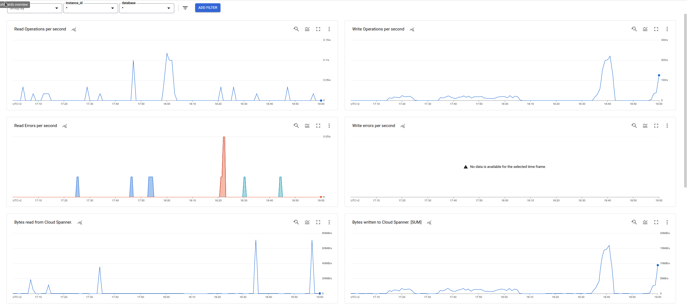
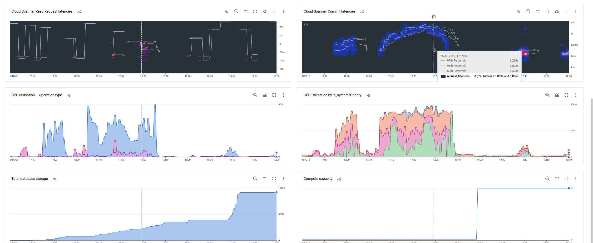

### Dashboards for Cloud Spanner

#### Notes

- The full list of Cloud Spanner Job metrics can be found [here](https://cloud.google.com/monitoring/api/metrics_gcp_p_z#gcp-spanner).

| Cloud Spanner |
|:------------------|
|Filename: [spanner.json](spanner.json)|
| This dashboard has charts for an overview of Cloud Spanner performance, including graphs for read and write operations and bytes per second; read and write error rates; read and write latencies shown as a heatmap with percentile lines; CPU usage and storage usage. |
||
||

